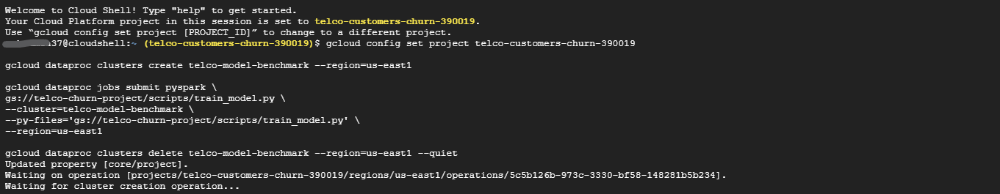
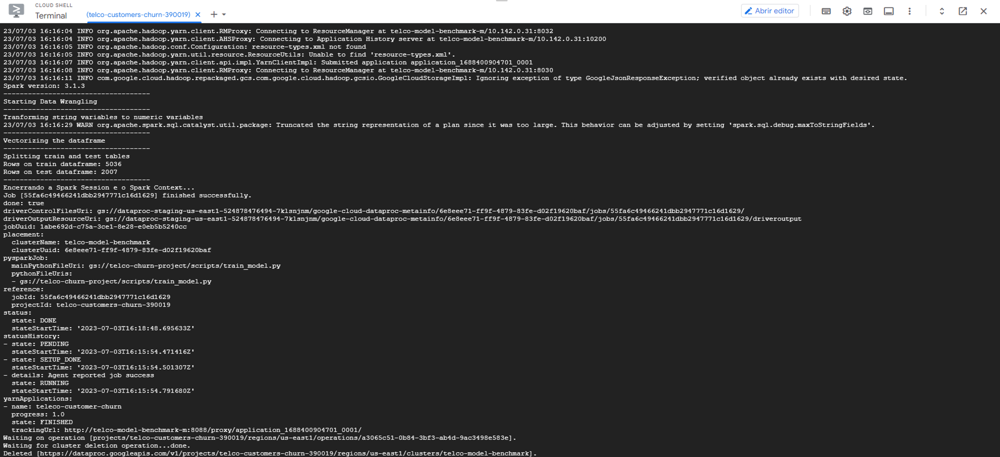

# Step 3 - Train model

We extracted this table from the results_from_dataproc.json file on the Step 2 folder, here we can see the scores from each model.
**Based on these results** from our models benchmarking, **we can pick our best model.** 
But, remember, to pick "the best model" we need to **take into consideration our business problem.**

|Model|Accuracy|F1-Score|Recall|
|---|---|---|---|
|Logistic Regression - Without Undersample|**0.807**|**0.798**|0.521|
|Logistic Regression|0.759|0.769|0.731|
|SVM|0.753|0.765|**0.770**|
|Random Forest|**0.762**|**0.772**|0.753|

So, our business problems asks us to predict the customers that might leave the company, and with that the company can anticipate their action and find a way to retain that said client.
 
With that in mind, a false positive means that our model classified a customer as a possible churn, but the customer didn't left, which is a positive outcome. We didn't lose the client, yay!!

On the other hand, a false negative means our model could not anticipate that customer's churn. Which is a pretty negative outcome. We lost a client, nay! :(

Gladly, we have our recall metric, which tell us the ratio of how many churns were classified correctly from our total number of churns. The higher the number, the fewer the false negatives and  the higher the true positives.

That will point us to the SVM and Random Forest models. Both models have similar accuracy and f1-score rates, but our SVM model presented a 0.017 positive difference on the recall metric. With that, we'll train our SVM model with the hyper-parameters we got from cross-validation, and use it to predict our future churns.

---

Great, we trained our model using PySpark and Dataproc, we exported our test dataset with all the predictions, and we can use that for further analysis. You can find the script for training and predicting on **train_model.py** and the results from our prediction on **predicted_results.csv**, the column "prediction" indicates if the customer was classified as or possible churn or not. If can also find the commands used on the GCP shell to create a cluster, run a job with our script and then delete the cluster on the **gcp_shell_commands.txt** file.

---

Here's some screenshots from our gcp shell running the script:

---

